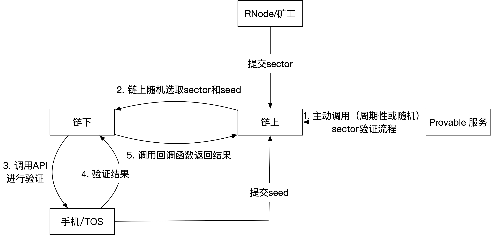
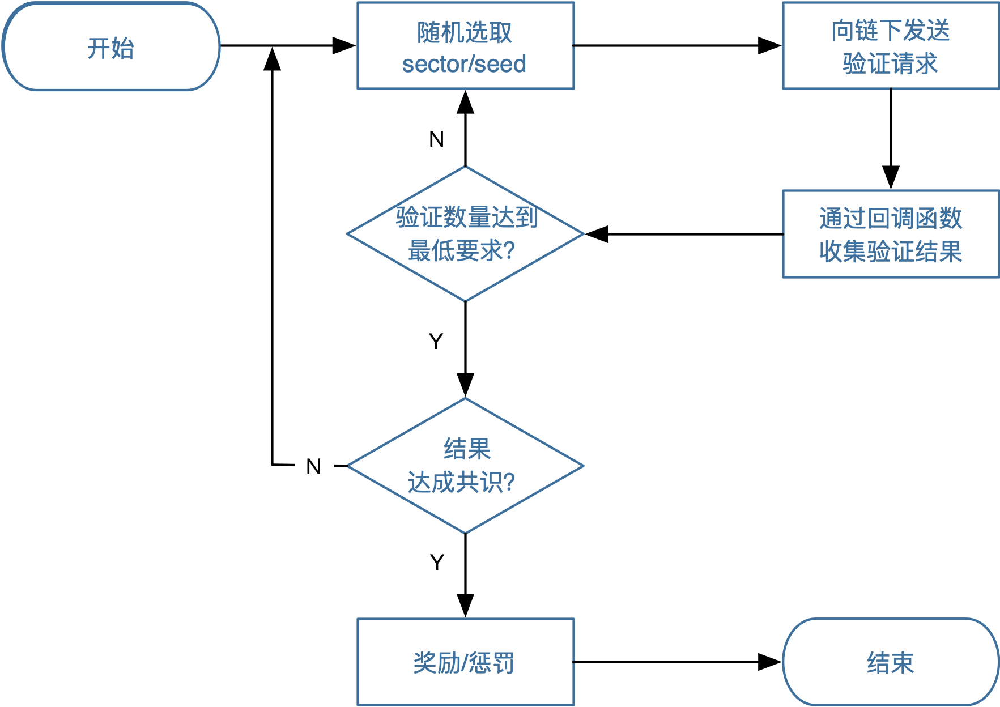

# 基于以太坊的TFC-Chain

以太坊支持图灵完全的智能合约，因此TFC-Chain的大部分逻辑都可以在智能合约中实现。

## 共识协议

### Proof-of-Work (PoW)

PoW是以太坊主网用到的共识协议，主要特征有：

- 挖矿耗费资源较多
- 出块时间间隔不确定
- 安全性高
- 任何人都可以加入挖矿

### Proof-of-Authority (PoA)

PoA是以太坊支持的另一个共识协议，一般用于测试链和私有链，主要特征：

- 挖矿不耗费资源
- 出块时间间隔固定
- 新矿工必须通过既有矿工的投票后才可加入挖矿

**TFC-Chain使用PoA较为合适**，其挖矿不耗费资源，出块稳定。

## TFC币

由于私有链有其自身的原生货币（native currency），例如ETH。

因此我们可以在TFC-Chain上使用原生货币作为TFC。

如果使用PoA共识协议，挖矿不产生TFC。则私有链初始化时需要将21亿TFC分配给一个保留账户，每天释放的TFC从这个保留账户中转出并分账。

TFC-Chain上的交易将使用TFC支付交易手续费。

PoA也支持将交易手续费设为零。

## 设计方案（草案）

TFC-Chain，用户注册、提交扇区/种子、分账，ERC20体现等业务都可以在智能合约中实现。

### Sector处理流程

上图所示的是TFC-Chain中提交Sector和验证Sector并发放奖励的过程。

每一个真实的RNode对应一个链上的RNode合约，矿工封装好一个sector之后，将sector的必要信息（如afid等）提交到RNode合约中。
同理，手机端拍的照片也需要将必要信息（afid）提交到链上。
链上维护一个sector列表和seed列表。

Sector的验证过程由Provable服务周期性（或随机）地发起。
智能合约内部需要随机在sector列表选择一个sector进行验证。
随机选取一个seed，和sector一起告诉给链下程序进行验证。

链下程序调用TOS提供的API来进行验证，链下程序调用智能合约的回调函数将验证结果返回给链上。
由于sector验证需要多个种子同时验证，智能合约内部实现以下流程：

链上重复性地发起验证流程，直到
- 有足够地验证数量
- 验证结果达成共识（较少数量/一致结果，较大数量/多数结果）

根据验证结果的共识，对这个sector奖励（发放TFC）或惩罚（扣除押金）。