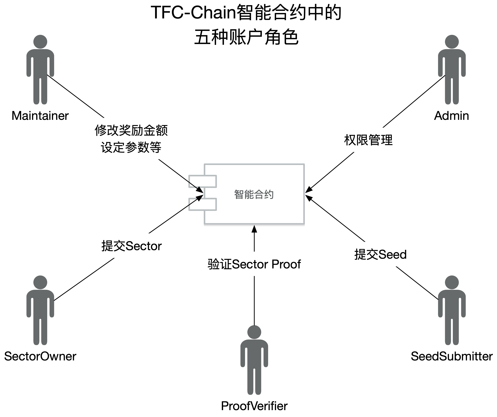

# TurboFil 智能合约设计

## 五种账户角色



TurboFil的智能合约设计中包括了五种角色，分别有不同的权限来执行不同的交易。
每个角色都可以有多个TFC-Chain上的账户。
每个账户也可以同时有多种角色。

账户角色的智能合约实现继承了`Openzeppelin`代码库中的[`AccessControl.sol`](https://docs.openzeppelin.com/contracts/4.x/access-control) 合约，可以使用相关接口。

### Admin (DEFAULT_ADMIN_ROLE)

属于Admin角色的账户拥有权限管理的权限。可以：
- 给其他账户授权某一种角色及其权限
- 收回其他账户的角色及其权限

#### 命令行调用

1. 设置交易发起账户和TFC-Chain接入点：[见配置文件设置](./README.md#配置文件) 。交易发起账户必须是Admin角色。
2. 执行hardhat task:

**给一个账户赋予角色及其权限**
```bash
yarn workspace @tfc-chain/core hardhat --network development grant-role --role <role> --account <address>
```

**收回一个账户的角色**
```bash
yarn workspace @tfc-chain/core hardhat --network development revoke-role --role <role> --account <address>
```
其中：
- `<role>`是角色种类，可选值为：`DEFAULT_ADMIN_ROLE`, `MAINTAIN_ROLE`, `SECTOR_ROLE`, `SEED_ROLE`, `VERIFY_ROLE`。
- `<address>`是被授予/收回角色的账户地址

### Maintainer (MAINTAIN_ROLE)

属于Maintainer角色的账户拥有维护TurboFil的权限。包括：
- 设置Sector验证通过时给予SectorOwner的奖励
- 设置Sector验证完成时给予SeedSubmitter的奖励
- 设置Sector验证完成时给予ProofVerifier的奖励
- 设置Sector验证完成需要的最少的提交验证结果的ProofVerifier数量
- 设置SectorOwner获得的奖励的锁定时间
- 设置SectorOwner提交Proof的时间限制
- 设置ProofVerifier验证Proof的时间限制
- 向TurboFil智能合约转账，TurboFil智能合约的TFC余额会用于发放奖励
- 提取TurboFIl智能合约中的所有TFC余额

#### 命令行调用

1. 设置交易发起账户和TFC-Chain接入点：[见配置文件设置](./README.md#配置文件) 。交易发起账户必须是Maintainer角色。
2. 执行hardhat task:

**设置Sector验证通过时给予SectorOwner的奖励**
```bash
yarn workspace @tfc-chain/core hardhat --network development set-sector-reward --reward <reward>
```

**设置Sector验证完成时给予SeedSubmitter的奖励**
```bash
yarn workspace @tfc-chain/core hardhat --network development set-seed-reward --reward <reward>
```

**设置Sector验证完成时给予ProofVerifier的奖励**
```bash
yarn workspace @tfc-chain/core hardhat --network development set-verify-reward --reward <reward>
```
其中`<reward>`为奖励金额，是一个用TFC最小单位表示的整数。

**设置Sector验证完成需要的最少的提交验证结果的ProofVerifier数量**
```bash
yarn workspace @tfc-chain/core hardhat --network development set-verify-threshold --threshold <threshold>
```
其中`<threshold>`代表验证proof时，能对proof是否有效达成共识的最小的proofVerifier的数量。

**设置SectorOwner获得的奖励的锁定时间**
```bash
yarn workspace @tfc-chain/core hardhat --network development set-lock-period --period <period>
```
其中`<period>`代表sector奖励的锁定周期。
例如：period=90 代表每一个给SectorOwner新发放的奖励，会在之后第90次发放奖励时解锁。

**设置SectorOwner提交Proof的时间限制**
```bash
yarn workspace @tfc-chain/core hardhat --network development set-submit-proof-timeout --timeout <timeout>
```
其中`<timeout>`代表当链上发出验证sector要求后，sectorOwner提交proof的时间限制，以区块数量来计算时间。
例如：timeout=6，代表链上发出验证sector要求后，sectorOwner必须在6个区块内提交proof，否则会被惩罚。

**设置ProofVerifier验证Proof的时间限制**
```bash
yarn workspace @tfc-chain/core hardhat --network development set-verify-proof-timeout --timeout <timeout>
```
其中`<timeout>`代表当sectorOwner提交proof后，proofVerifier进行验证并提交验证结果的时间限制，以区块数量来计算时间。
例如：timeout=6，代表当sectorOwner提交proof后，proofVerifier必须在6个区块内提交proof的验证结果，否则不会收到验证奖励。

**向TurboFil智能合约转账，TurboFil智能合约的TFC余额会用于发放奖励**
```bash
yarn workspace @tfc-chain/core hardhat --network development fund-turbofil --amount <amount>
```
其中`<amount>`为向TurboFil智能合约转账的金额，是一个用TFC最小单位表示的整数。

**提取TurboFIl智能合约中的所有TFC余额到调用者账户**
```bash
yarn workspace @tfc-chain/core hardhat --network development withdraw-turbofil
```

### SectorOwner (SECTOR_ROLE)

SectorOwner角色的账户拥有提交Sector的权限，通常来说，每一个RNode是SectorOwner。
SectorOwner在收到链上发出的验证要求后，需要提交proof。

#### 命令行调用

1. 设置交易发起账户和TFC-Chain接入点：[见配置文件设置](./README.md#配置文件) 。交易发起账户必须是SectorOwner角色。
2. 执行hardhat task:

**提交Sector**
```bash
yarn workspace @tfc-chain/core hardhat --network development submit-sector --afid <afid>
```
其中`<afid>`为sector的afid-lite，为28个字节的hex字符串。

**监听Sector验证要求**
```bash
yarn workspace @tfc-chain/core hardhat --network development listen-verification-task --sector <sector>
```
其中`<sector>`为sector的在链上对应的地址（Sector合约地址）。`--sector`选项也如果被省略，则监听所有sector。

**提交Proof**
```bash
yarn workspace @tfc-chain/core hardhat --network development submit-proof --verification <verification> --afid <afid>
```
其中`<verification>`为本次verification的ID（Verification合约地址），`<afid>`为proof的afid-lite，为28个字节的hex字符串。

### SeedSubmitter (SEED_ROLE)

SeedSubmitter角色的账户拥有提交Seed的权限。
在Seed被成功用于验证sector之后，会获得奖励（seed reward）

#### 命令行调用

1. 设置交易发起账户和TFC-Chain接入点：[见配置文件设置](./README.md#配置文件) 。交易发起账户必须是SeedSubmitter角色。
2. 执行hardhat task:

**提交Seed**
```bash
yarn workspace @tfc-chain/core hardhat --network development listen-verification-task --afid <afid>
```
其中`<afid>`为seed的afid（afid-lite），为28个字节的hex字符串。

### ProofVerifier (VERIFY_ROLE)

ProofVerifier角色的账户负责在SectorOwner提交proof后进行验证，并提交验证结果。
验证结果生效后会获得奖励（verify reward）。

#### 命令行调用

1. 设置交易发起账户和TFC-Chain接入点：[见配置文件设置](./README.md#配置文件) 。交易发起账户必须是ProofVerifier角色。
2. 执行hardhat task:

**监听Sector Proof的提交**
```bash
yarn workspace @tfc-chain/core hardhat --network development listen-proof-submission
```

**提交Proof验证结果**
```bash
yarn workspace @tfc-chain/core hardhat --network development verify-proof --verification <verification> --result <result>
```
其中`<verification>`为本次verification的ID（Verification合约地址），`<result>`为proof验证是否通过的bool值。

## 智能合约及其之间的关系


TFC-Chain上主要有三种智能合约：TurboFil，Sector和Verification。

TurboFil合约只有唯一的一个实例，它是大部分功能的入口。Sector合约是对应每一个sector的，也就是说，每次有一个新的sector提交，链上就会生成一个新的sector合约。同样，Verification合约对应每一次sector验证，每次有一个sector被选中进行验证时，就会创建一个新的Verification合约进行验证。

### TurboFil 合约
TurboFil合约在链上只有一个， 是TFC-Chain大部分功能的调用入口。

TurboFil中权限管理的功能继承了`Openzeppelin`代码库中的`AccessControl.sol` 合约。实际使用场景大部分情况下是管理员在命令行调用进行账户角色的授予和收回。具体实现参见[Openzeppelin文档](https://docs.openzeppelin.com/contracts/4.x/access-control) 。

#### 属性

```solidity
/// @notice The number of blocks before which sector owner must submit proof after the verification is requested.
uint256 public submitProofTimeout;

/// @notice The number of blocks before which verifiers (those who has VERIFY_ROLE) must submit proof verification result after the submitProofTimeout is reached.
uint256 public verifyProofTimeout;

/// @notice The minimum number of verifiers (those who has VERIFY_ROLE) required to decide whether a sector proof is valid or not.
uint256 public verifyThreshold;

/// @notice The amount of TFC to give seed submitter as reward each time when the sector is verified.
uint256 public seedReward;

/// @notice The amount of TFC to give sector owner as reward each time when the sector is verified.
uint256 public sectorReward;

/// @notice The amount of TFC to give verifier as reward each time when the sector is verified.
uint256 public verifyReward;

/// @notice The number of subsequent verifications after which the sector reward is unlocked and paid to sector owners.
uint256 public lockPeriod;
```

这些属性对应了前面MAINTAIN_ROLE可以维护的参数。
他们每一个都有对应的set函数来由MAINTAINER设置值。

#### 提交Sector
**前提条件**
- 交易发起账户拥有`SECTOR_ROLE`权限。

```solidity
/// @notice Submit sector (afid) and specify its owner.
/// @notice Deposit must be paid when calling this function.
/// @dev This function allows delegate submission which means
///      someone who has SECTOR_ROLE can submit sector on behalf of
///      someone else, specifying the sector owner in the argument.
/// @param owner address of the sector owner
/// @param afid afid of the sector
function submitSector(address payable owner_, bytes28 afid_) payable external
```
提交Sector需要在交易中附上相当于`lockPeriod * sectorReward`数量的TFC的转账，用于抵押。
此函数会创建一个Sector合约，并发出一个事件：
```solidity
/// @notice SectorSubmission event is emitted when a new sector is submitted.
/// @param owner the address of the sector owner.
/// @param afid the afid of the sector.
/// @param sector the address of the created Sector contract.
event SectorSubmission(address owner, bytes28 afid, address sector);
```
函数内部逻辑的说明详见：[ARCHITECTURE](./ARCHITECTURE.md#Sector提交)

#### 提交Seed
**前提条件**
- 交易发起账户拥有`SEED_ROLE`权限。

```solidity
/// @notice Submit seed (its afid)
/// @dev This function select the sector to verify based on the seed afid and timestamp.
/// @dev If a sector is currently under verification, we skip it and select the next sector.
/// @dev A Verification contract will be created to perform the verification logic for the selected sector.
/// @param seed the afid of the seed
function submitSeed(bytes28 seed_) public 
```
此函数会创建一个Verification合约，并发出一个事件：
```solidity
/// @notice VerificationTask event is emitted when a seed is submitted and a sector is selected to verify.
/// @param sector_afid the afid of the sector.
/// @param seed the afid of the seed.
/// @param verification the address of the created verification contract.
event VerificationTask(bytes28 indexed sector_afid, bytes28 seed, address verification);
```
函数内部逻辑的说明详见：[ARCHITECTURE](./ARCHITECTURE.md#Sector验证)

### Sector合约

每个提交到链上的Sector都对应一个Sector合约。
Sector合约中记录的该sector的拥有者（owner）以及afid。

通常情况下，链下程序不会直接调用Sector合约的函数。

#### Sector验证结果事件

每次Verification完成后，被验证的sector合约会发出VerificationResult事件：
```solidity
/// @notice VerificationResult event will be emitted every time a verification is settled for this sector.
/// @param seed the afid of the seed used in this verification
/// @param result whether the verification pass or fail
/// @param reward the amount of TFC the sector get as reward in this verification (if pass)
/// @param punish the amount of TFC the sector is punished in this verification (if fail)
event VerificationResult(bytes28 seed, bool result, uint256 reward, uint256 punish);
```
链下程序可以检索这个事件来获取某一个sector获得奖励的历史记录，或者监听这个事件来获知新的奖励。

### Verification合约

每次有seed被提交的时候，就会挑选一个sector进入验证逻辑。
每次验证逻辑开始时，一个新的Verification合约会被创建，它的生命周期仅在本次验证过程中有效。

Verification合约中记录了当前验证过程所处的阶段：
- STATUS_WAITING：代表本次验证仍处于等待sector owner提交proof的阶段
- STATUS_VERIFYING：代表本次验证处于proof已提交，等待超级节点提交验证结果的阶段。

Verification合约中还记录了：
- 如果验证完成，给各方发放奖励的金额。
- 被验证的sector的合约地址
- 被用于验证的seed afid

#### 提交Proof
Verification合约中的sector的owner需要给Verification合约提交proof
```solidity
/// @notice Submit proof of the sector for verification
/// @notice This function must be called by sector owner
/// @param proof_ the afid of the proof
function submitProof(bytes28 proof_) onlyStatus(STATUS_WAITING) external
```
proof提交后Verification合约会发出ProofSubmitted事件，超级节点需要监听这个事件，在proof提交后，验证proof并提交验证结果。
```solidity
event ProofSubmitted(bytes28 sector_afid, bytes28 seed, bytes28 proof);
```

#### 提交验证结果
在proof提交后，超级节点需要验证这个proof并提交验证结果（proof是否有效）。
```solidity
/// @notice Submit the verification result of the proof. 
/// @notice This function must be called by users who has VERIFY_ROLE in TurboFil contract.
/// @param result_ whether the proof is valid or not
function verifyProof(bool result_) onlyStatus(STATUS_VERIFYING) external 
```
每次一个超级节点提交验证结果后，Verification合约都会发出ProofVerified事件。链下程序可以检索或者监听这个事件。
```solidity
event ProofVerified(bytes28 sector_afid, bytes28 seed, bytes28 proof, bool result);
```
当验证结果在超级节点之间达成多数共识后（提交true或false的超级节点数超过TurboFil合约中设置的阈值），Verification合约会发出VerifyFinish事件。
```solidity
event VerifyFinish(bool result);
```

#### 过期Verification回收
因为TFC的奖励是预支给Verification合约的（这样在验证过程结束后才能自动发放奖励），所以如果Verification合约在规定时间内没有提交proof或者没有足够的超级节点提交验证结果，那么TFC奖励需要退回TurboFil合约。

在这种情况下，需要一个链下程序调用Verification合约的collectFunds函数：
```solidity
/// @notice collect TFC that is not given as reward.
function collectFunds() public 
```
这种情况不会很多因为验证sector会获得奖励，sector owner和超级节点会有足够的动机去及时提交proof或验证结果。